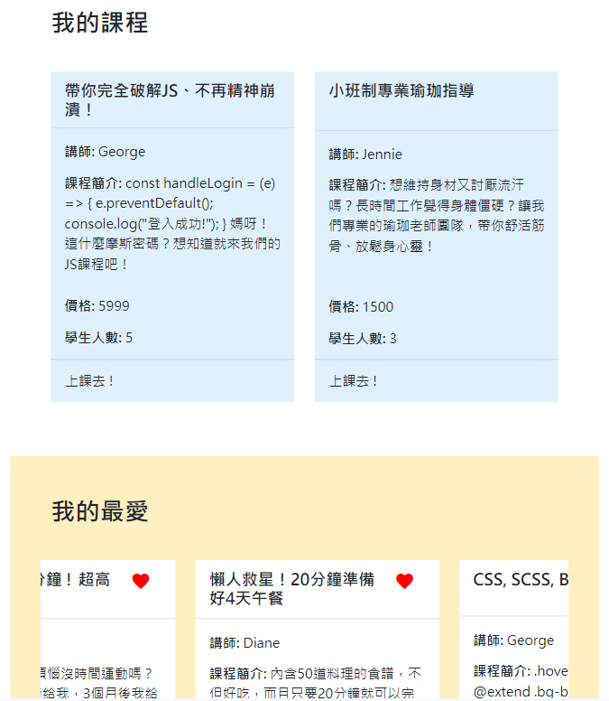
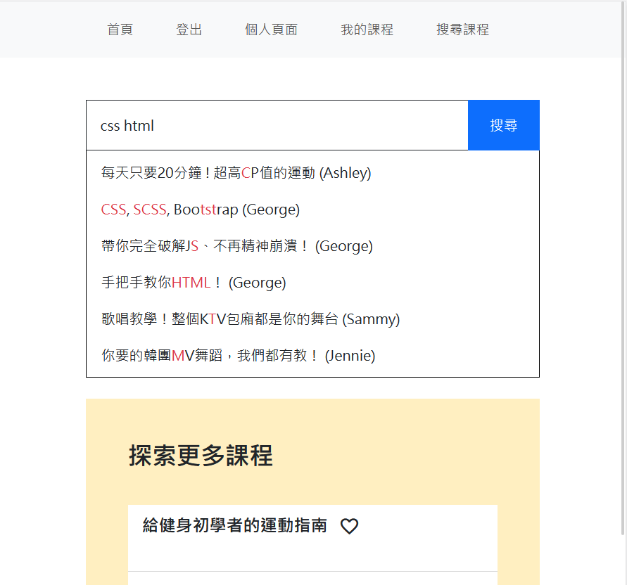
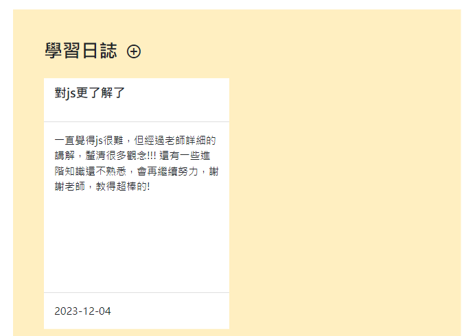
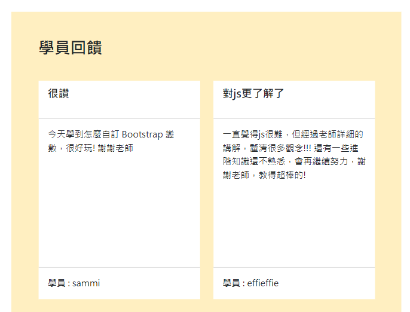

# Learning System
Learning System 是一個線上學習平台，提供講師開設課程及學生註冊課程。  
Learning System is an online platform for instructors to set up courses and students to take classes.

## 框架及系統說明 Framework and System
前端: React, Bootstrap 5  
後端: Node.js  
React and Bootstrap 5 for Front-end. Node.js for Back-end.

## 功能 Features
* 註冊、登入、登出
* 關鍵字搜尋課程
* (講師) 開設及編輯課程
* (學員) 註冊課程
* (學員) 設定我的最愛
* (學員) 撰寫學習日誌、決定是否與講師分享
* (講師) 接收學員給的回饋
* Sign up, Log in, Log out.
* Search courses with keywords.
* (For instructors) set up and modify courses.
* (For students) enroll courses.
* (For students) mark courses as My Favorite and remove them from the list.
* (For students) write learning journey and choose whether to share them with instructors.
* (For instructors) receive feedbacks from students.

## 技術 Technologies
* Axios
* bcrypt
* Joi
* Json Web Token
* Mongoose & Mongo DB
* Passport
* SASS 7 + 1 Pattern

## 資料夾結構 Structure of Folders
前端:
* client
  * assets
    * scss - scss 程式碼放置處
    * video - 示範用影片放置處
  * components - 自訂的 React 元件及共通區塊放置處
  * pages - React 頁面放置處
  * service - 介接後端 API 程式碼放置處

後端:
* server
  * config - Passport 及 JWT 驗證
  * models
  * routes
 
Front-end:
* client
  * assets
    * scss - scss codes
    * video - demo video
  * components - customized React components and layouts 
  * pages - React pages
  * service - API calls to the back-end

後端:
* server
  * config - Passport and JWT authentication 
  * models
  * routes

## 畫面範例 Brief Demo

學員個人課程頁面 (註冊 + 我的最愛)

關鍵字搜尋課程

學員撰寫學習日誌

  

講師獲得學員回饋

